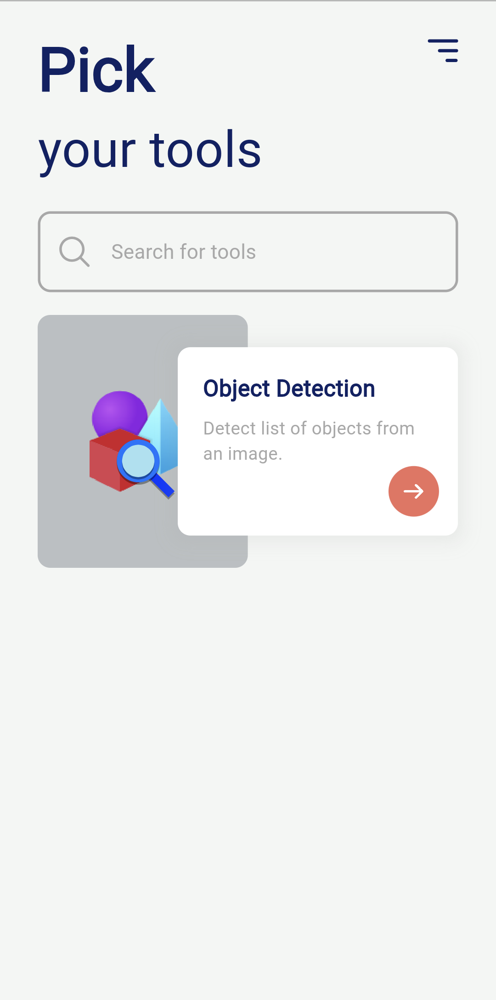
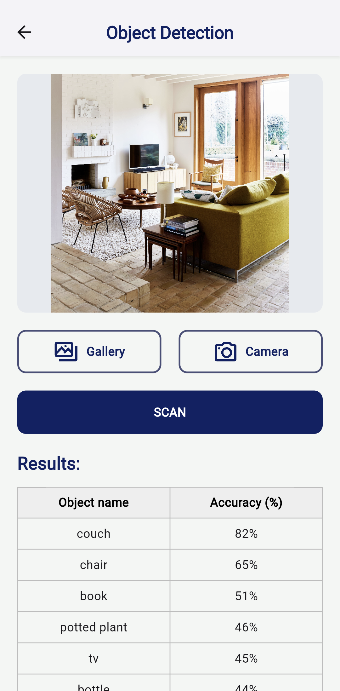

# Simple Tools App

🛠️ Welcome to Simple Tools App - Your Go-To Toolbox for Various Utilities! 🧰

## Features

Explore a diverse range of tools and utilities all in one app. 

- Object detection

(More tools will be added in the future).

## Libraries

Here are some of the libraries that have been used in the app:

- [flutter_bloc](https://pub.dev/packages/flutter_bloc): State management made easy.
- [dio](https://pub.dev/packages/dio): Powerful HTTP client for making network requests.
- [get_it](https://pub.dev/packages/get_it): A simple service locator for Dart and Flutter projects.
- [flutter_screenutil](https://pub.dev/packages/flutter_screenutil): Design responsive and adaptive Flutter UI.
- [go_router](https://pub.dev/packages/go_router): A declarative, customizable routing library for Flutter.
- [fpdart](https://pub.dev/packages/fpdart): Functional programming constructs and utilities for Dart.
- [mocktail](https://pub.dev/packages/mocktail): Mock library for Dart.

And a few more...

## Set Up

1. Create an environment file named `.env` in the root directory.
2. Add the following line to your `.env` file, replacing `'YOUR_API_KEY'` with your actual API key (from [here](https://api-ninjas.com/profile)):

    ```ini
    API_NINJAS_KEY='YOUR_API_KEY'
    ```

3. Run the following commands in your terminal:

    ```bash
    flutter clean
    flutter pub get
    flutter run
    ```

4. (Optional) to build an `.apk` file:

    ```bash
    flutter build apk
    ```


## Folder Structure

Here's a simple folder structure of this project.

> _**Note**: it may have more folders and files in there_

```plaintext
simple_tools_app/
|-- assets/
|-- lib/
|   |-- src/
|   |   |-- app/
|   |   |-- core/
|   |   |-- features/
|   |   |   |-- feature-1/
|   |   |   |   |-- data/
|   |   |   |   |   |-- data_sources/
|   |   |   |   |   |-- models/
|   |   |   |   |   |-- repositories/
|   |   |   |   |-- domain/
|   |   |   |   |   |-- repositories/
|   |   |   |   |   |-- entities/
|   |   |   |   |   |-- usecases/
|   |   |   |   |-- presentation/
|   |   |   |   |   |-- blocs/
|   |   |   |   |   |-- pages/
|   |   |   |   |   |-- widgets/
|   |   |   |-- feature-2/
|   |   |   |-- ...
|   |   |-- app.dart
|   |-- main.dart
|-- test/
|-- .env   # Created in [Set Up]
|-- pubspec.yaml
```

## User Interface

📸 Home Page:



📸 Object Detection Page:


